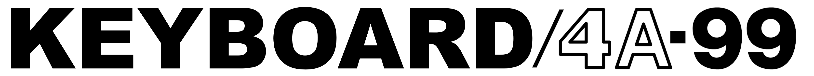
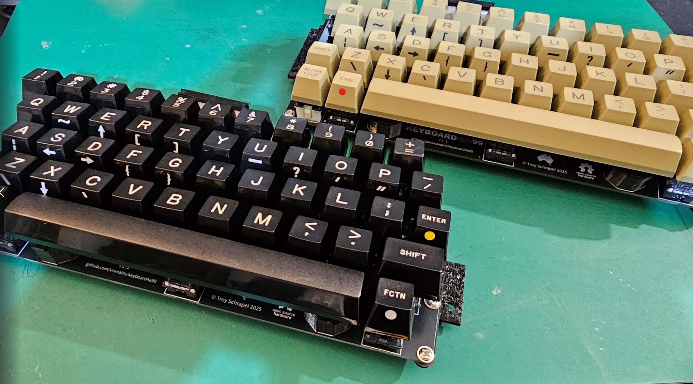
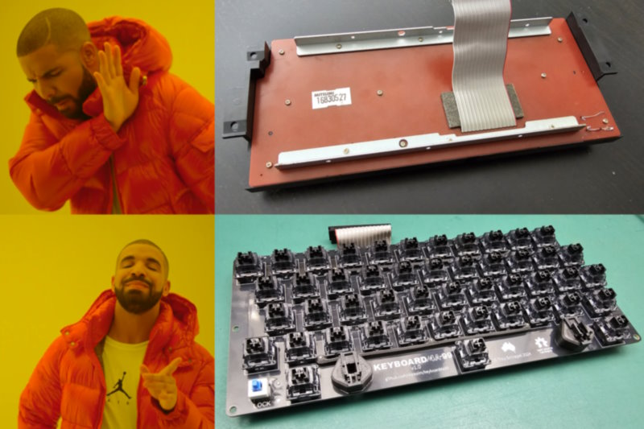
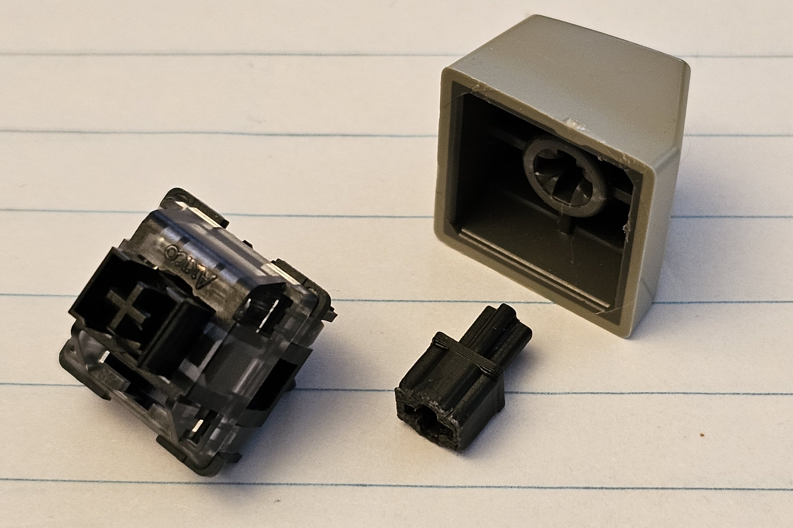
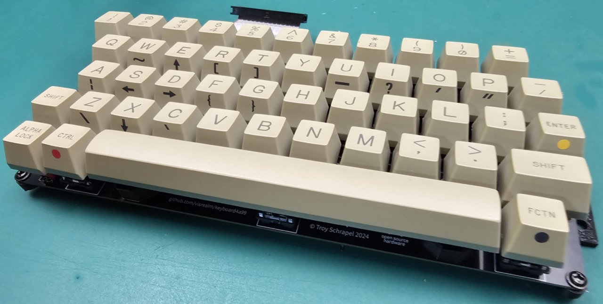
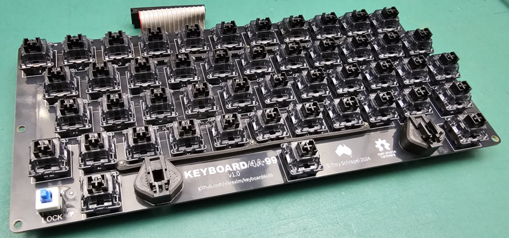
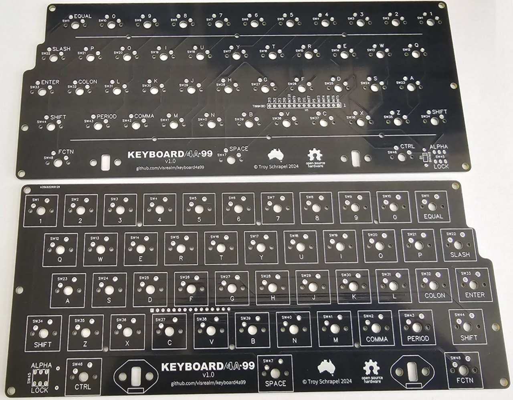

# Introduction

Finally! a Cherry MX compatible upgrade for the infamous Mitsumi mylar keyboards that plague many unfortunate Texas Instruments TI-99/4A computers.

The upgrade consists of a new PCB and a handful of 3D printed parts. The original look is maintained by re-using the original key caps (and some other original parts). Add the switches of your choice and you're set! A brand new keyboard for your TI-99/4A.

## Only Mitsumi boards?

Currently, the upgrade is designed for the Mitsumi keyboards since their mylar innards gives the most grief to TI-99 users. It is possible other TI-99/4A keyboard brands could be adapted to use this upgrade in the future, hower that would rely on community input.

## The hardware

The Gerber file for the KEYBOARD/4A-99 PCB is available in the [/pcb](pcb) directory. I recommend the PCB is ordered in black.

#### New version: v1.1

Verion 1.1 adds support for re-using the original alpha-lock switch. The original switch provides much greater throw than the replacement I used in v1.0. As a result, the keycap adapters for v1.1 are slightly taller to match the taller alpha lock key. Also, the mounts are slightly slimmer.

STLs for all 3D printed items are located under [/stl](stl). 

**Note:** Not all STLs are required.

Check out the [documentation](doc) for more details, including a [bill of materials](doc#bill-of-materials) and full build process.

## Purchasing options

KEYBOARD/4A-99 PCBs and kits are available on my Tindie store:

Also (more convenient for North America)

<a href="https://www.arcadeshopper.com/wp/store/#!/Keyboard99-Mitsumi-membrane-replacement-PCB-only/p/648592668"></img></a>

For those outside the US, you can support the project by purchasing direct from my [PCBWay project page](https://www.pcbway.com/project/shareproject/KEYBOARD_4A_99_0361cd65.html). 

## Detailed build instructions

Also check out the [documentation](doc) for more details.

### Thanks

Thanks to [PCBWay](https://pcbway.com/g/186WQ9) for supporting this project.

### Gallery

### Licence

All hardware designs and products you can find in this repository is licensed under [CERN Open Hardware Licence Version 2 - Weakly Reciprocal](/LICENCE.txt)
