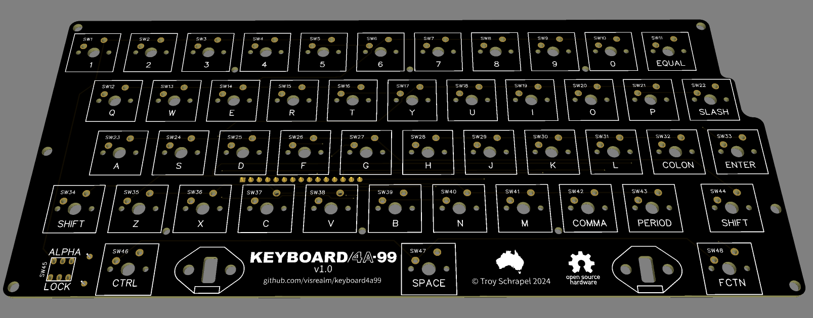
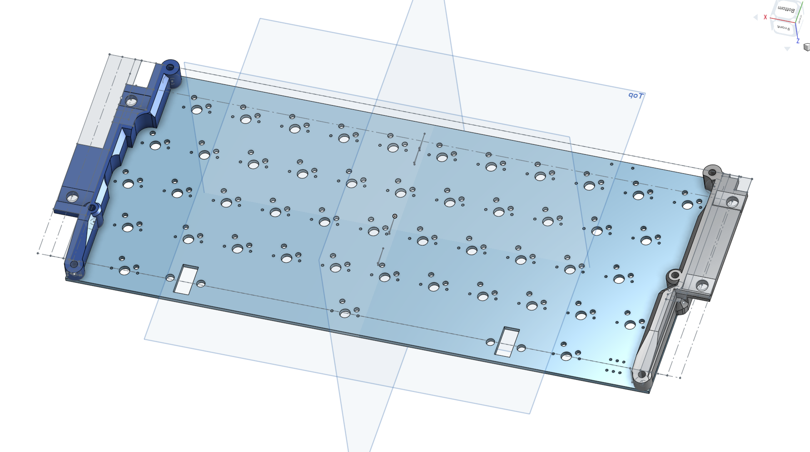
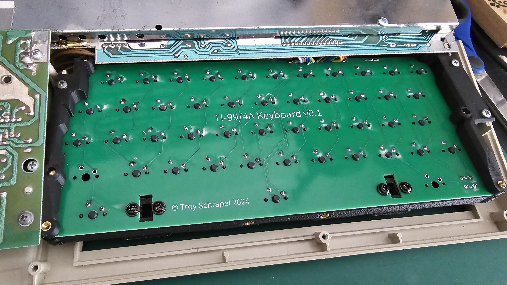
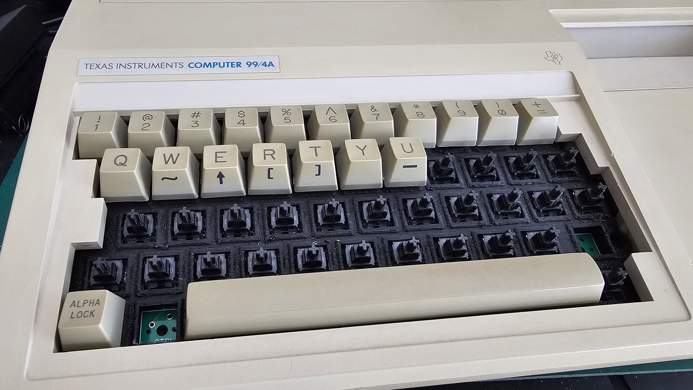
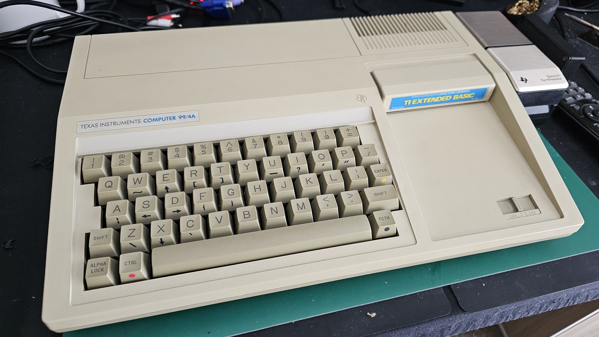

# KEYBOARD/4A-99

Cherry MX compatible upgrade for the infamous Mitsumi mylar keyboards in many unfortunate Texas Instruments TI-99/4A computers.

This repository is a placeholder. Expect Schematics, Gerbers, STLs and procedures soon.

### Documentation (WIP)

Initial documentation can be found in the [/docs](docs) directory.

### Gallery

### Thanks

Thanks to [PCBWay](https://pcbway.com/g/186WQ9) for supporting this project.

### Licence

All hardware designs and products you can find in this repository is licensed under [CERN Open Hardware Licence Version 2 - Weakly Reciprocal](/LICENCE.txt)
