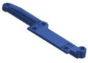

## Index

- [Introduction](#introduction)
- [Bill of Materials](#bill-of-materials)
- [3D Printing Notes](#3d-printing-notes)
  - [Threaded inserts](#threaded-inserts)
- [Detailed upgrade procedure](#detailed-upgrade-procedure)
  - [Disassembly](#disassembly)
    - [Key caps](#key-caps)
      - [Space bar](#space-bar)
      - [Keycap puller](#keycap-puller)
    - [Keyboard removal](#keyboard-removal)
    - [Keyboard disassembly](#keyboard-disassembly)
      - [Ribbon cable](#ribbon-cable)
      - [Space bar mounts](#space-bar-mounts)
  - [Assembly](#assembly)
    - [Ribbon cable](#ribbon-cable-1)
    - [Metal supports](#metal-supports)
    - [Diode (Alpha lock fix)](#diode-alpha-lock-fix)
    - [Switches](#switches)
    - [Alpha lock](#alpha-lock)
    - [Space bar](#space-bar-1)
      - [Mounting options](#mounting-options)
      - [Attaching space bar mounts](#attaching-space-bar-mounts)
      - [Attach the space bar](#attach-the-space-bar)
    - [Key caps](#key-caps-1)
    - [PCB Mounts](#pcb-mounts)
    - [Computer re-assembly](#computer-re-assembly)
  - [Troubleshooting](#troubleshooting)

# Introduction

This project is intended as an **upgrade** for an existing Mitsumi mylar "keyboard". As such, you will require one of these (probably non-functioning) "keyboards" to begin. 
We will be re-using all of the original keycaps, the metal PCB support strips and screws, and (optionally) the space bar support brackets and 15-pin ribbon connector.

Don't feel bad for it. That brown abomination should have been relegated to landfill years ago. It's one of the lucky ones!

# Bill of Materials

Here's the full list of items you'll need to complete this upgrade. Some of these items are optional, many are 3D printed, and some can be salvaged from your mylar monster.

| Qty  | Description                                         | Thumbnail                                                                                | Notes                                                                                                                                                                                                                                                                                                                                                                                                                                     |
| :--- | :-------------------------------------------------- | :--------------------------------------------------------------------------------------- | :---------------------------------------------------------------------------------------------------------------------------------------------------------------------------------------------------------------------------------------------------------------------------------------------------------------------------------------------------------------------------------------------------------------------------------------- |
| 1    | Mitsumi mylar TI-99/4A "keyboard"                   |                                                                | To pillage keycaps and (optionally) other components                                                                                                                                                                                                                                                                                                                                                                                      |
| 1    | KEYBOARD/4A-99 PCB                                  |                                                                    | I recommend ordering it in Black. But, you do you. See [/pcb](../pcb/)                                                                                                                                                                                                                                                                                                                                                                    |
| 47   | Cherry MX compatible key switches                   |                                                            | I have tested [Akko V3 Cream Black (Amazon)](https://www.amazon.com/Akko-Keyboard-Dustproof-Mechanical-Switches/dp/B0CBK74L29). Unfortunately, they only come in 45 packs. Such is life.<br>**Important:** Check your switches have the two additional locating pins. Some of these only have the centre locating pin. These won't be as stable. )                                                                                        |
| 1    | 8mm latching button                                 |                                                        | For Alpha lock. [GPBS-800L (Mouser)](https://www.mouser.com/ProductDetail/CW-Industries/GPBS-800L?qs=sajaCoHCXPRO4feefwykvw%3D%3D)                                                                                                                                                                                                                                                                                                        |
| 1    | 1N4148 Diode (Optional)                             |                                                                 | Can be jumpered if you don't want the [ALPHA LOCK fix](http://www.mainbyte.com/ti99/console/alpha_lock.html)                                                                                                                                                                                                                                                                                                                              |
| 1    | 15-pin 0.1" pitch x ~75mm+ female IDC cable         |                                                              | Can re-use cable from original "keyboard".<br>Can use new dupont cable (optionally, with a header on the PCB).<br>New parts: Can get two from a [IDSS-15-D-06.00-G-R (Mouser)](https://www.mouser.com/ProductDetail/Samtec/IDSS-15-D-06.00-G-R?qs=82jvyl5dHWdNzrTJ70gz7A%3D%3D) or one from a [IDSS-15-S-03.00-T-G-ST4 (Mouser)](https://www.mouser.com/ProductDetail/Samtec/IDSS-15-S-03.00-T-G-ST4?qs=9r4v7xj2Lnnz8e%252BG4N9S7g%3D%3D) |
| 10   | 3x8mm self-tapping<br>**OR**<br>M3x5 machine screws |                                                         | Either [3x8mm self tapping (Amazon)](https://www.amazon.com/Oneyijun-Tapping-Mushroom-Fasteners-Drilling/dp/B096MWH691)<br>**OR**<br>[M3x5 machine screws (Amazon)](https://www.amazon.com/a16051600ux0507-Stainless-Phillips-Machine-Fasteners/dp/B01LK6YGF2) to suit brass inserts.                                                                                                                                                     |
| 10   | M3 x 5.7 x 4.6mm brass inserts (Optional)           |                                                          | [M3 x 5.7 x 4.6 from Amazon](https://www.amazon.com/uxcell-Knurled-Printing-Threaded-Embedment/dp/B0CB8LKVYF)                                                                                                                                                                                                                                                                                                                             |
| 1    | PCB mount (left)                                    | [](../stl/keyboard4a99-pcb-mount-left-selftap.stl)      | 3D printed ([self tapping](../stl/keyboard4a99-pcb-mount-left-selftap.stl) or [brass insert](../stl/keyboard4a99-pcb-mount-left-inserts.stl) options available)                                                                                                                                                                                                                                                                           |
| 1    | PCB mount (right)                                   | [](../stl/keyboard4a99-pcb-mount-right-selftap.stl)    | 3D printed ([self tapping](../stl/keyboard4a99-pcb-mount-right-selftap.stl) or [brass insert](../stl/keyboard4a99-pcb-mount-right-inserts.stl) options available)                                                                                                                                                                                                                                                                         |
| 2    | PCB support backer                                  | [](../stl/keyboard4a99-pcb-support-backing.stl)     | 3D printed. The metal supports on the original keyboard will screw into [these](../stl/keyboard4a99-pcb-support-backing.stl).                                                                                                                                                                                                                                                                                                             |
| 2    | Space bar support                                   | [](../stl/keyboard4a99-spacebar-adapter-selftap.stl) | 3D printed (self tapping or brass insert options available)<br>Two model options available:<br> * One to [re-use Mitsumi spacebar support](../stl/keyboard4a99-spacebar-adapter-selftap.stl) (pictured)<br>* Another two-piece model using all new 3D printed components                                                                                                                                                                  |
| 45   | Keycap adapter (standard)                           | [](../stl/keyboard4a99-switch-array.stl)                | 3D printed. [7x7 array](../stl/keyboard4a99-switch-array.stl) model is also available.                                                                                                                                                                                                                                                                                                                                                    |
| 1    | Keycap adapter (space bar)                          | [](../stl/keyboard4a99-switch-space.stl)                | 3D printed. I've found the slot in the space bar is slightly larger. It could just me mine?.                                                                                                                                                                                                                                                                                                                                              |
| 1    | Keycap adapter (right shift)                        | [](../stl/keyboard4a99-switch-rshift.stl)        | 3D printed                                                                                                                                                                                                                                                                                                                                                                                                                                |
| 1    | Keycap adapter (alpha lock)                         | [](../stl/keyboard4a99-switch-alpha.stl)     | 3D printed                                                                                                                                                                                                                                                                                                                                                                                                                                |

# 3D Printing Notes

All 3D printed models were designed using Onshape. If you need to make modifications, the project is available here: [KEYBOARD/4A-99 on Onshape](https://cad.onshape.com/documents/30d24a60e4ff53542fc4ebb4/w/1ff27c22063da5b9cb2d7645/e/a78a0ae34698a1552e1e650e)

In developing this upgrade, all items were printed using:
* **Printer:** Creality Ender-3 V3 KE
* **Nozzle:** 0.4mm
* **Filament:** 1.75mm Elegoo PLA+ (PETG would likely work very well too)
* **Layer height:** 0.15mm
* **Supports:** Yes, from bed only (except for standard keycap adapters - no supports)

**Note:** The keycap adapters in particular require very fine tolerances. The models I've provided may or may not provide the correct tolerances with your printer/material/settings and also minor differences in keycaps and switches. Again, the Onshape project can be used to adjust these for your specific setup. 

## Threaded inserts

All of the models which accept screws have two versions. One which takes threaded inserts and another designed to take a self-tapping screw directly. e.g.

```
keyboard4a99-pcb-mount-left-inserts.stl
keyboard4a99-pcb-mount-left-selftap.stl
```

| Type          | Hole diameter | Notes                                                                                                                          |
| :------------ | :------------ | :----------------------------------------------------------------------------------------------------------------------------- |
| Brass inserts | 4.5mm         | [M3 x 5.7 x 4.6 from Amazon](https://www.amazon.com/uxcell-Knurled-Printing-Threaded-Embedment/dp/B0CB8LKVYF)                  |
| Self tapping  | 2.8mm         | [3mm x 8mm self tapping screws from Amazon](https://www.amazon.com/Oneyijun-Tapping-Mushroom-Fasteners-Drilling/dp/B096MWH691) |

If you require a different hole size, the Onshape project includes a global variable `#threadsize` to control this.

# Detailed upgrade procedure

This video covers the entire build procedure:

{INSERT VIDEO LINK WHEN AVAILABLE}

However, if you prefer to read all about it...

## Disassembly

### Key caps

I recommend removing the key caps from the keyboard first. You can remove them later if you'd prefer, but the keyboard is a bit easier to remove from the TI-99 case sans key caps. 

Each cap can be pulled vertically using a key cap puller, a flat bladed screw driver, a butter knife or old fashioned finger strength and determination. We want to re-use these key caps on our sweet new mechanical switches, so try not to damage to them.

Underneath each key, you will find a spring. We won't be needing the springs for the upgraded keyboard - perhaps an art project?

#### Space bar

The space bar is attached to a central plunger just like the other keys, however it also has a piano wire stabilizer. Pop the spacebar off the button, but don't pull it away from the keyboard. Then you will see the wire. The wire is clipped in at both sides of the keyboard and needs to be unclipped by pushing the wire towards the bottom edge of the keyboard.

#### Keycap puller

If you need a keycap puller, I have used and can recommend this [TI-99 keycap puller by Darryl Hirschler on Thingiverse](https://www.thingiverse.com/thing:6565856)


Just push it in over each key, then gently pull it out. With any luck, it will have brought the key out with it. If not, try again. Failing that, revert to old fashioned finger strength and determination.

### Keyboard removal

It's time to rid your TI-99 of the Mitsumi board. Flip the computer upside down and remove the seven (7) screws holding it all together.


If you have a black and silver model, you also need to remove the power switch extension by pulling it directly outwards/forwards. If it's stuck, pull harder.

Now, you should be able to gently remove the base of your computer by raising it up. Place it aside. Not there! ... That's a better spot.


The inside of your TI should look something like the above photo. It probably won't have red arrows pointing at the screws, but these are the screws you need to remove. Two (2) from the internal power supply board and four (4) from the keyboard mounts.

Move the PSU board aside just enough to expose the keyboard mount, then jiggle the old keyboard out of its home. Once it's free, you will need to remove the 15-pin ribbon cable from the TI-99 main board. It might be easier to rotate the old keyboard away from you and place it on top of the main board, leaving the cable exposed (and vulnerable). Gently jiggle the 15-pin connector downwards and free the keyboard from the TI-99.

Move the TI-99 aside. You could place it on the base ... over there.

### Keyboard disassembly

With the keyboard removed, it's time to salvage a few more parts. In order to open the Mitsumi keyboard, you will first need to unsolder (or is it de-solder?) the alpha lock key. Just melt the solder at each of the joints and separate the horizontal wires from the alpha lock pins.


Next, remove the hundred or so tiny screws which hold the keyboard together and hold the metal support brackets in place. Yes, you need to remove each and every one.

We will be re-using the metal support brackets. If your keyboard doesn't have metal support brackets, you'll need to resort to plan B. (**Note to self:** Document plan B)

**Hint:** If you think you've removed them all and it's still not coming apart, look under the ribbon cable. You didn't see that one, did you? Remove it!

Now, you should be able to separate the PCB from the keyboard body. Be careful not to flip the keyboard body over "the right way" because all of the key actuators will fall out. If you already flipped the keyboard body over, you should notice a bunch of actuators all over your desk. Swipe them aside then throw the keyboard body across the room. Go and retreive the keyboard body, because you still need it.

Carefully place the keyboard body (hopefully still containing the actuators) aside. 

#### Ribbon cable

If you're not re-using your old ribbon cable, then skip ahead to [Space bar mounts](#space-bar-mounts).

So, it seems you're re-using your old ribbon cable. Nice! You will need to de-solder it. Melt the solder at each pad, and suck the solder away (using a solder sucker - I probably should have mentioned that first). You should then be able to remove the ribbon cable by holding a soldering iron on the pad at one end while gently prying the ribbon cable away at angle away from that pad. Work your way to the other end with the soldering iron, while pulling sideways on the ribbon cable.

Actually, you could avoid all that and just cut it off at the base, but then you'll have to strip and tin each of the wires on your (now slightly shorter) ribbon cable. Personally, I'd go for the de-solder and pry option.

#### Space bar mounts

If you're not re-using your original space bar mounts, there is an option to print new ones. But, I'd suggest re-using the originals if you can. They're just... better. 

Back to the old keyboard body. Unclip the space bar mounts by pinching them with your fingers then ejecting them out the front of the keyboard. If your fingers aren't as slim and nimble as they once were, you could use some pointy pliers instead.


Now, find and retreive the space bar mounts which were fired across the room.

## Assembly

The fun part! Right?

Order of operations is important here. Resist the temptation to solder on those new mechanical switches first thing. If you've already soldered on the switches, tested out that satisfying new switch action and are now thinking "how do I solder the ribbon cable? let me check the documentation", it's not the end of the world, but you probably need to remove at least a few of those switches before continuing.

### Ribbon cable

If you're re-using the Mitsumi ribbon cable, you might need to tidy up the ends a little. Perhaps given them a little trim in order to fit into the holes nicely. If you're using a new double-ended cable or you cut the old Mitsumi cable off instead of unsoldering (or is it de-soldering?), you'll need to strip and tin the ends of the cable. If you've decided to do your own thing and solder a pin-header to the PCB instead, just jump through to [Metal supports](#metal-supports).

First, ensure you're looking at the back of the PCB. The side with the silkscreen markings for the ribbon cable, not the side with all the square key outlines. 

Next, ensure the correct orientation of the ribbon cable. You'll want the connector end of the cable to be headed towards the top of the keyboard (hint: the space bar is at the bottom) with female connector facing away from the PCB. Like this:


With the above spatial concerns in order, insert the tinned ends of the ribbon cable into the PCB. Hold it in firmly place with one hand, flip the board over and solder the ribbon cable ends to the PCB with your other two hands. If you only have two hands, you can hold the assembly with one hand, then using your other hand, collect some solder onto the solder tip and blob it on to the first wire of the cable. Then do it again for the last wire. The messy blobs of solder should hold it in place so you can place the keyboard down and solder all fifteen (15) wires to the PCB. I suggest leaving the blobby ends til last, lest the cable falls out of the board again when you re-melt the solder. If you have less than two hands, well done on getting this far.

### Metal supports

The new PCB is reasonably sturdy, but over the full width of a keyboard, it needs a little assistance to stay flat. The PCB has mounting holes for the Mitsumi metal brackets. Using six of the original hundred or so tiny screws from the back of the Mitsumi keyboard, attach both of the metal brackets to the PCB as pictured.

I suggest placing a layer or two of sticky tape (Scotch tape for the American speakers) on the PCB-facing... face of each metal strip. This will add some wear protection between the metal and the PCB. You can wrap the tape around the edges of the metal strip.

The metal brackets should be oriented thusly:


You will need a 3D printed support backer for each of the metal brackets. Three screws for each through the metal bracket, the PCB and into the 3D printed backer. 

Test the rigidity of the now-supported PCB by attempting to snap it in half. If you succeeded to snap it in half, jump back to [I recommend ordering it in Black](#bill-of-materials).

### Diode (Alpha lock fix)

The diode can be replaced with a piece of wire (jumper) if you don't have one, or if you're not interested in the [ALPHA LOCK fix](http://www.mainbyte.com/ti99/console/alpha_lock.html). 

Insert the 1N4148 diode (or jumper wire) next the the alpha lock button location, ensuring the black line is oriented towards the double line on the PCB silkscreen. Flip the PCB back over and solder the diode in place.

### Switches

So, you now have a new KEYBOARD/4A-99 PCB with a ribbon cable, a diode and some metal support brackets installed. It's time for the switches!


Insert all forty-seven (47) Cherry MX compatible switches into the top face of the PCB. Or perhaps you'd prefer to do them in batches? Anyway, insert the switches. Either support the PCB on each end to allow the switches to "fall through" or hold the PCB with one hand and insert all the switches with the other. Then you'll need to turn the board over to solder the switches. If you turned the board over before continuing to read, you'll find the switches have now fallen out onto the desk (jump back to [Switches](#switches)).

Turning the board over is... tricky. Place something flat, thin and relatively rigid over the top, squeeze the whole assembly together as you rotate it bottom-side-up. Place the whole assembly on to your work surface, then carefully slide the keyboard assembly off the flat, thin, rigid thing onto your desk. Or, you can slide the flat, thin, rigid thing out from under your keyboard assembly - like the tablecloth trick.

Before soldering, you'll want to apply weight to the keyboard. You'll need some small, heavy things to place on top. Solder the pins you can access, move the small, heavy things over and solder those pins, etc. You just want to ensure the switches are fully inserted into the PCB as they're soldered.


### Alpha lock

Insert the 8x8mm latching button and solder into place. 

### Space bar

The space bar is mounted atop a regular switch, but is supported on each end with a wire to provide lateral stability. We need to add the mounting points for this wire.

#### Mounting options

If you are re-using the Mitsumi space bar clips (recommended), you will need two (2) 3D printed [keyboard4a99-spacebar-adapter](../stl/keyboard4a99-spacebar-adapter-selftap.stl) mounts (pictured left below). Your original space bar clips should clip into the top face of the printed adapter.


If you don't have the original clips (perhaps you couldn't find them during the [find and retreive the space bar mounts which were fired across the room](#space-bar-mounts) step). You will, instead, require two (2) 3D printed [keyboard4a99-spacebar-block](../stl/keyboard4a99-spacebar-block-selftap.stl) and two (2) [keyboard4a99-spacebar-clip](../stl/keyboard4a99-spacebar-clip.stl) (picture right above).

The clip should be printed on its side (pictured below) and inserted into the block before mounting on the PCB.


#### Attaching space bar mounts

Attach each of the space bar mounts to the PCB using screws, with the stabilizer clips facing the bottom (outside) of the board.

#### Attach the space bar

I recommend attaching the space bar first, since it's the most finicky. Before attaching the space bar, ensure the piano wire is clipped in on both sides and centered on the space bar. Also, add the space bar switch adapter to your key switch. Then push each side of the stabilizing wire into its mounting clip on the PCB. You should hear a click. You should then be able to rotate the space bar in to place on the switch adapter.

### Key caps

The key caps you rescued can now be placed upon the new switches using the appropriate adapter for each key type. I recommend installing the keycaps before installing the PCB mounts and (obviously) before mounting the keyboard into the computer, because you can apply a more even pressure to them.


* **Standard:** For most keys. You will find this model in singular ([keyboard4a99-switch-standard](../stl/keyboard4a99-switch-standard.stl)) and 7x7 array ([keyboard4a99-switch-array](../stl/keyboard4a99-switch-array.stl)) form.
* **Space:** The space bar might need a slightly larger pin. This model ([keyboard4a99-switch-space](../stl/keyboard4a99-switch-space.stl)) will hopefully fill that... space.
* **Right shift:** The right shift button is wider and has two (2) mounting holes. This model ([keyboard4a99-switch-rshift](../stl/keyboard4a99-switch-rshift.stl)) adapts to a single central switch.
* **Alpha lock:** Alpha lock is handled by a latching button. This model ([keyboard4a99-switch-alpha](../stl/keyboard4a99-switch-alpha.stl)) adapts to it.

Before proceeding, check the fit of each adapter type with the switches and also with the key caps. The tolerances here are very small.

Insert the adapter onto your switch first, then press the key cap on top. Rinse and repeat for all keys.


### PCB Mounts

Using three (3) screws for each, attach the mounts to the PCB as pictured:


### Computer re-assembly

Reversing the order of operations from [Keyboard removal](#keyboard-removal), connect the 15-pin connector to the main board, jiggle the new keyboard in place and re-attach using the two (2) mounting screws on each side.

Move the internal PSU board back in place and re-attach with its two (2) mounting screws.

Ensure the rear PSU cable is routed appropriately and ensure the switch extension is positioned correctly over the switch on the PSU board before replacing the base of the computer. 


Re-attach the base with its seven (7) mounting screws. Flip the computer right side up, plug it in and test!

## Troubleshooting

If you're having issues with the keyboard not working or working intermittently, it's almost certainly going to be a problem with the ribbon cable connection or the pin header on the main board. Re-check this cable. Possibly, re-flow the main board pin header.